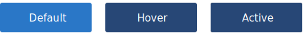

Button provide methods for users to take action in an interface. They are placed throughout you UI and often serve as the main action of a component.

[ Image / interactive example of Component ]

## Usage
The usage section is a bullet pointed list of scenarios the component should be used in.


# Design
Buttons are available in 3 variants - [Primary](#primary), [Secondary](#secondary), and [Tertiary](#tertiary). These variants allow you to establish [hierarchy](#hierarchy) in your interfaces.

## Anatomy
The Anatomy is the breakdown of the component.

[ Image breaking down the component’s anatomy ]

1. **Container**. The container element wraps the component.
2. **Label**. Labels describe the button action to the user. If text is not used, an icon should be used in its place.
3. **Icon** (optional). The button component can optionally have icons placed either to the left or right of the label. No more than 1 icon should be used per button.

## Sizing & Spacing
The Button component has 4 sizes available to use - small, regular, large, and xLarge.
By default, you should use the regular button - this has been designed to fit the majority of UI use cases. For forms, the Large button has been created so it sits at the same height as the [textInput](/components/textInput) component. The small and xLarge buttons are available for specific use cases where the primary/large buttons are unsuitable.

## Hierarchy & Placement
Establishing visual hierarchy in your UI is important as it helps the user understand the main actions of your page or component. The Primary, Secondary, and Tertiary buttons have different application use cases, so be sure to read the following sections to understand where best to use these variations.

---

### Primary Button


#### Usage
The Primary Button is responsible for the most important action of a particular page.

### States (if applicable)
Like all variations of the Button component, the Primary Button has 3 states - default, hover, and focus.


### Hierarchy & Placement
Try to avoid using multiple Primary Buttons in the same piece of UI - this can confuse the user as to what the main action is. If you need multiple actions, decide which action is the most important/often used and make this your Primary Button. All other actions should take the form of Secondary or Tertiary Buttons.

---

### Secondary Button

[ Image / interactive example of Component ]

#### Usage
The Primary Button is responsible for the most important action of a particular page.

### States (if applicable)
[ Image / interactive example of component states ]

### Hierarchy & Placement
Try to avoid using multiple Primary Buttons in the same piece of UI - this can confuse the user as to what the main action is. If you need multiple actions, decide which action is the most important/often used and make this your Primary Button. All other actions should take the form of Secondary or Tertiary Buttons.

---

### Tertiary Button

The Tertiary Button is a text styled button that has no border or background.

#### Usage
For de-emphasised actions, 

### States (if applicable)
[ Image / interactive example of component states ]

### Hierarchy & Placement


# Develop
Introduction to the development section.

## Installation
To install the COMPONENT_NAME component, first install the Standards Component Library via `npm`.

```
    npm install @royalnavy/react-component-library
```

Then inside your project, explicitly import the component you need:

```
    import { ComponentName } from '@royalnavy/react-component-library'`
```

## Basic Usage

```
    Basic HTML for the component is placed here.
```

---

### Variation [ Repeatable ] 
Introduction to the component variation. For each sub heading, outline any differences between the default component and this variation. 

### Usage

```
    Code block for differing HTML
```

# Properties
This section contains specific properties for the component.

| Name      | Type   | Required | Default  | Description  |
-----------------------------------------------------------
| className | String | True     |          |              |

---

### Adornment [ Repeatable ]
Much like the design section, the Adornment block is a repeatable section, outlining any Adornments a component may have and how to apply them.

[ Image / interactive example of Component ]

#### Usage

```
    Code block for Adornment
```

# Properties
This section contains specific properties for the adornment.

| Name         | Type    | Required  | Default  | Description  |
----------------------------------------------------------------
| className    | String  | True      |          |              |

---

## Style Hooks

The following CSS classes are used to style the COMPONENT_NAME component. Use these classes to hook into the component if you need to override specific properties.

| CSS Class  | Required  | Description      |
---------------------------------------------
| .class     | True      | The main styles  |


# Properties
This section contains all available props for the component.

| Name       | Type     | Required  | Default  | Description  |
---------------------------------------------------------------
| className  | String   | True      |          |              |


#### Storybook

To view all the variations of this component, including interactive examples, please visit our [Storybook](https://react-storybook.royalnavy.io/?selectedKind=buttons&full=0&addons=0&stories=1&panelRight=0&addonPanel=storybook%2Factions%2Factions-panel&show-info=0&source=0).
