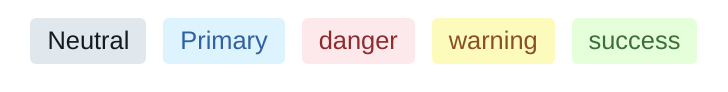
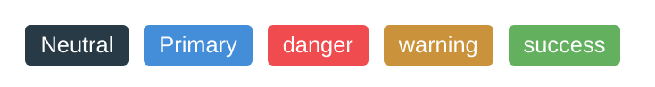
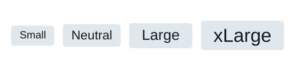
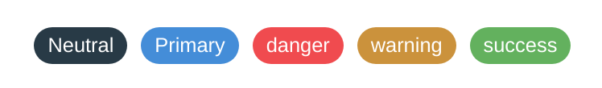

## Types and usage

A Button can be solid or faded and can either be a regular badge shape or more rounded
in the form of a pill.

## Examples

### Colours

<br/>


```
<Badge color="neutral" colorVariant="faded">Neutral</Badge>
<Badge color="action" colorVariant="faded">Action</Badge>
<Badge color="danger" colorVariant="faded">Danger</Badge>
<Badge color="warning" colorVariant="faded">Warning</Badge>
<Badge color="success" colorVariant="faded">Success</Badge>

<Badge color="neutral" colorVariant="solid">Neutral</Badge>
<Badge color="action" colorVariant="solid">Action</Badge>
<Badge color="danger" colorVariant="solid">Danger</Badge>
<Badge color="warning" colorVariant="solid">Warning</Badge>
<Badge color="success" colorVariant="solid">Success</Badge>
```

<hr/>


### Size 



```
<Badge colorVariant="faded" size="small">Small</Badge>
<Badge colorVariant="faded" size="regular">Neutral</Badge>
<Badge colorVariant="faded" size="large">Large</Badge>
<Badge colorVariant="faded" size="xlarge">xLarge</Badge>
```

<hr/>

### Pill variation


```
<Badge color="neutral" variant="pill">Neutral</Badge>
<Badge color="action" variant="pill">Action</Badge>
<Badge color="danger" variant="pill">Danger</Badge>
<Badge color="warning" variant="pill">Warning</Badge>
<Badge color="success" variant="pill">Success</Badge>
```

<hr/>

## Properties

| Name      | Type           | Required | Default | Description                                                                                   
| --------- | -------------- | -------- | ------- | -----------
| children  | ReactNode      | True     |         | The content to place in the button, typically text   
| color     | string         | False    | neutral | (neutral/action/danger/warning/success) The colour for the badge
| colorVariant | string      | False    | sold    | (solid/neutral) The colour style for the button
| size      | string         | False    | regular | (small/regular/large/xlarge) The size for the badge
| variant   | string         | False    | teriary | (pill) The style variation
                                                                                 

