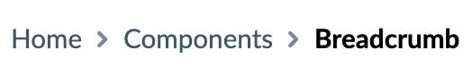

## Usage
The `Breadcrumbs` component accepts an array of links, including the current
page title and href. Like the Nav component the Breadcrumbs component will
render regular links by default, but if you pass a `Component` property with
a link you can specify the component to render it and send the properties it
needs, such as a Gatsby `Link` component that will require `to` instead of `href`.

## Examples



```
const links = [
  {
    href: '/',
    label: 'Home',
  },
  {
    href: '/components',
    label: 'Components',
  },
  {
    href: '/components/breadcrumb',
    label: 'Breadcrumb',
  },
]

<Breadcrumbs links={links} />
```

## Properties

### Breadcrumbs

| Name        | Type           | Required | Default  | Description
| ---------   | -------------- | -------- | -------  | -----------
| className   | string         | False    |          | Optional extra css class to attach to the wrapper element
| links       | Array<any>     | True     |          | An array of link items using the format described below |


### Breadcrumb

The properties required for a Breadcrumb link depend on the component that will render the link for it. 
If no component is passed in with the link then a default 'Link'component will be used to render 
an anchor tag. Any properties in the link props wil be passed to the render component. One example of 
an alternative item render component would be a React Router Link, this requires a 
'to' property. The label property is used as the child of the render component.

| Name        | Type            | Required | Default  | Description
| ---------   | --------------- | -------- | -------  | -----------
| Component   | ReactNode       | False    | Link     | By default          |
| label       | string          | True     |          | The text to display |
