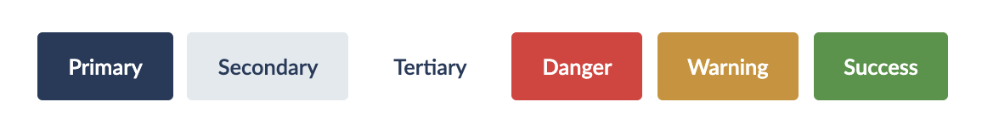
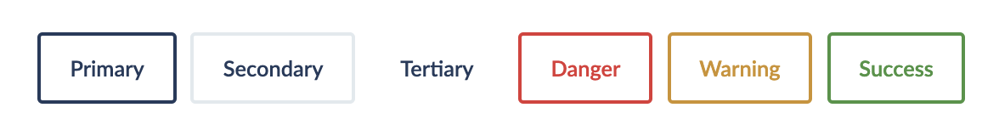
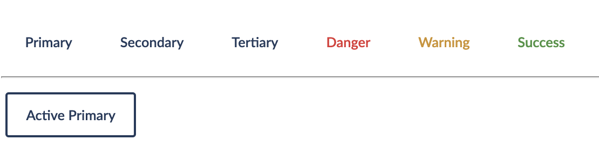
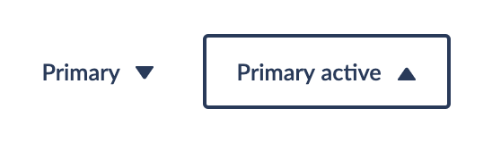
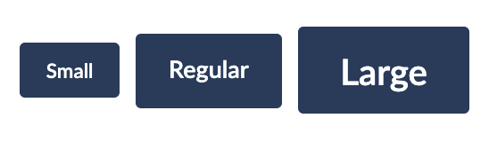

## Types and usage

Buttons can be styles in a range of different ways including solid, outline and plain.
Further variations can apply such as small buttons and large buttons. Buttons can also
optionally display an icon, displayed on the right of text. Additionally a button can
accept a customer class name to add additional styling.

The primary use for a button is to invoke an action, though they can also sometimes indicate a state (such as open or closed.). Buttons should not be used for navigation, unless the navigation is required to perform an action such as add a new data item.

## Examples

### Solid



```
<Button onClick={action} state="primary">Primary</Button>
<Button onClick={action} state="secondary">Secondary</Button>
<Button onClick={action} state="tertiary">Tertiary</Button>
<Button onClick={action} state="danger">Danger</Button>
<Button onClick={action} state="warning">Warning</Button>
<Button onClick={action} state="success">Success</Button>
```

<hr/>

### Outline 



```
<Button onClick={action} state="primary" variation="outline">Primary</Button>
<Button onClick={action} state="secondary" variation="outline">Secondary</Button>
<Button onClick={action} state="tertiary" variation="outline">Tertiary</Button>
<Button onClick={action} state="danger" variation="outline">Danger</Button>
<Button onClick={action} state="warning" variation="outline">Warning</Button>
<Button onClick={action} state="success" variation="outline">Success</Button>
```

<hr/>

### Plain 



```
<Button onClick={action} state="primary" variation="plain">Primary</Button>
<Button onClick={action} state="secondary" variation="plain">Secondary</Button>
<Button onClick={action} state="tertiary" variation="plain">Tertiary</Button>
<Button onClick={action} state="danger" variation="plain">Danger</Button>
<Button onClick={action} state="warning" variation="plain">Warning</Button>
<Button onClick={action} state="success" variation="plain">Success</Button>

<Button className="is-active" onClick={action} state="primary" variation="plain">Active primary</Button>
```

### Icon 



```
<Button onClick={action} state="primary" variation="plain" icon={<TriangleDown />}>
  Primary
</Button>

<Button className="is-active" onClick={action} state="primary" variation="plain" icon={<TriangleUp />}>
  Primary active
</Button>
```

### Size 



```
<Button onClick={action} state="primary" size="small">Small</Button>
<Button onClick={action} state="primary" size="regular">Regular</Button>
<Button onClick={action} state="primary" size="large">Large</Button>
```

## Properties

| Name      | Type           | Required | Default | Description                                                                                   
| --------- | -------------- | -------- | ------- | -----------
| children  | Node or String | True     |         | The content to place in the button, typically text   
| className | String         | False    |         | Custom css class to add to the button element
| icon      | Node           | False    |         | Icon to display to the right of text in the button. Accepts any Node but ideally would be an image or svg tag                       
| onClick   | Func: ()=>void | True     |         | Function to call when a user clicks on a button
| size      | String         | False    | regular | (small/regular/large) The size for the button
| state     | String         | False    | neutral | (primary/secondary/danger/warning/success/neutral) The style/type of button to display. Primary buttons should be used for actions such as submitting a form, secondary for other actions on a form and the default (neutral) for actions like cancel
| variation | String         | False    | solid   | The style of button (solid/outline/plain)                                                                                           

