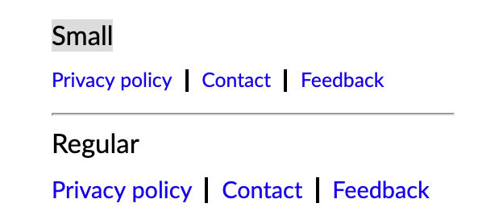

## Usage
The `Links` component renders a list of links inline with a pipe seperator, this is most useful for
situations like a page footer with links to give feedback or look at the privacy policy.

Like the Nav component the Links component accepts an array of items. If no Component is specified
for an item then a regular `A` tag is used, otherwise the Component passed will be rendered with
the remaining properties.

## Examples



```
<Fragment>
  <Links size="small" links={[
    {
      href: '/privacy',
      label: 'Privacy policy',
    },
    {
      href: '/contact',
      label: 'Contact',
    },
    {
      href: '/feedback',
      label: 'Feedback',
    },
  ]} />

  <Links links={[
    {
      href: '/privacy',
      label: 'Privacy policy',
    },
    {
      href: '/contact',
      label: 'Contact',
    },
    {
      href: '/feedback',
      label: 'Feedback',
    },
  ]} />
</Fragment>
```


### Custom render component
```
<Links links={[
  {
    Component: 'Link',
    to: '/privacy',
    label: 'Privacy policy',
  },
  {
    Component: 'Link',
    to: '/contact',
    label: 'Contact',
  },
  {
    Component: 'Link',
    to: '/feedback',
    label: 'Feedback',
  },
]} />
```

## Properties
### Links

| Name        | Type           | Required | Default  | Description
| ---------   | -------------- | -------- | -------  | -----------
| className   | string         | False    |          | Optional extra css class to attach to the wrapper element
| links       | Array<any>     | True     |          | An array of link items using the format described below |
| size        | string (small/regular) | False    | regular  | The font size for items  |

### LinkItem

The properties required for a link item depend on the component that will render it. If no component is passed in with
the item then a default 'Link'component will be used to render the link. Any properties in the link props wil be passed to the
render component. One example of an alternative nav item render component would be a React Router Link component, this 
requires a 'to' property. The label property is used as the child of the render component.

| Name        | Type            | Required | Default  | Description
| ---------   | --------------- | -------- | -------  | -----------
| Component   | ReactNode       | False    | Link     | By default          |
| label       | string          | True     |          | The text to display |

### Link

The default Links link render component. Renders a link.

| Name        | Type           | Required | Default  | Description
| ---------   | -------------- | -------- | -------  | -----------
| className   | string         | False    | rn-links__link |
| label       | string         | True     |          | The text to display |
| url         | string         | True     |          | The url to send the browser to |

