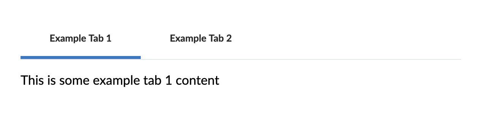

## Usage
The `TabSet` component allows the user to switch between different sets of related content within a single page.

## Examples



```
<TabSet tabs={[
  {
    name: 'Example Tab 1',
    label: 'This is some example tab 1 content',
  },
  {
    href: 'Example Tab 2',
    label: 'This is some example tab 2 content',
  },
]} onChangeCallback={(id, name) => { console.log(id, name) }} />
```

## Properties
### TabSet

| Name        | Type           | Required | Default  | Description
| ---------   | -------------- | -------- | -------  | -----------
| className   | string         | False    |          | Optional extra css class to attach to the wrapper element
| tabs        | Array<any>     | True     |          | An array of tab names and asssociated content
| onChangeCallback | Function<any>     | False     |          | A callback function invoked when the active tab is changed |

