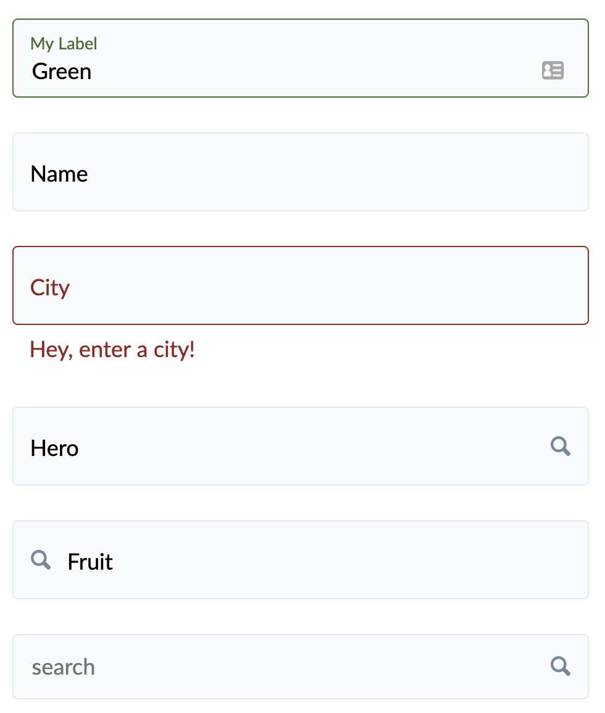

### Usage

the `TextInput` component can be used for any text/number based input within a form. The initial release 
for this component has been written to work with <a href="https://jaredpalmer.com/formik/">Formik</a>
though a Redux Forms variation will follow.

The TextInput component can be used on it's own in a regular form, if you use the correct syntax, or used wtihin a Formik form as the render component for a `Field`.



```
  <Formik initialValues={initialValues} onSubmit={onSubmit} validationSchema={validationSchema}>
    <Form>
      <Field className="rn-textinput--is-valid" name="colour" component={TextInput} label="My Label" />
      <Field name="name" component={TextInput} label="Name" />
      <Field name="city" component={TextInput} label="City" />
      <Field name="hero" component={TextInput} endAdornment={<Search />} label="Hero" />
      <Field name="fruit" component={TextInput} startAdornment={<Search />} label="Fruit" />
      <Field name="search" component={TextInput} placeholder="search" />
    </Form>
  </Formik>
```

The `TextInput` component accepts the standard field properties as defined by Formik but is also
responsible for rendering an optional field label and any information or error messages associated 
with the field. The component can also render 'Adornments'. An Adornment is a visual item at the start or
end of a field:


## Properties

### FieldProps

| Name       | Type                        | Required | Default | Description                                     
| ---------- | --------------------------- | -------- | ------- | -----------
| name       | string                      | true     |         | The field name  |
| value      | string                      | false    |         | The field value |
| onChange   | (React.SyntheticEvent):void | false    |         | A function called when field value changes |
| onBlur     | (React.SyntheticEvent):void | false    |         | A function called when the field looses focus |


### FormProps

| Name       | Type                 | Required | Default | Description                                     
| ---------- | -------------------- | -------- | ------- | -----------
| errors     | { string: string }   | false    | {}      | A hashmap using the field name as a key and the error message associated with it |
| touched    | { string: boolean }  | false    | {}      | A hashmap using the field name as a key and indicating if it has been touched or not |

### TextInput 

| Name            | Type            | Required | Default | Description                                     
| --------------- | --------------- | -------- | ------- | -----------
| className       | string          | false    |         | An optional css class name to add to the component wrapper |
| disabled        | boolean         | false    | false   | Mark the field as disabled/inactive |
| endAdornment    | React.ReactNode | false    |         | An optional component to display at the end of a field, such as a search svg |
| field           | FieldProps      | true     |         | A field object either manually send to the component or sent from Formik |
| footnote        | string          | false    |         | An optional string to display below a field |
| form            | FormProps       | true     |         | Can be manually provided or sent from Formik. Indicates any errors and which fields have been touched |
| id              | string          | false    | uuid()  | Provide the ID for a field and tie it to it's label. If one is not provided then a unique id will be created |
| label           | string          | false    |         | Ideally a field should include a label to help the user understand what the field is for and help screen readers |
| placeholder     | string          | false    |         | If a label is not provided then a placeholder should be. |
| startAdornment  | React.ReactNode | false    |         | An optional component to display at the start of a field, such as a search svg |
| type            | string          | false    | text    | The field type if it is not a standard text field |
                                                                                 
Any additional properties passed to the component will be attached to the input element, this allows the creation of number fields with min and max values or aria tags.
