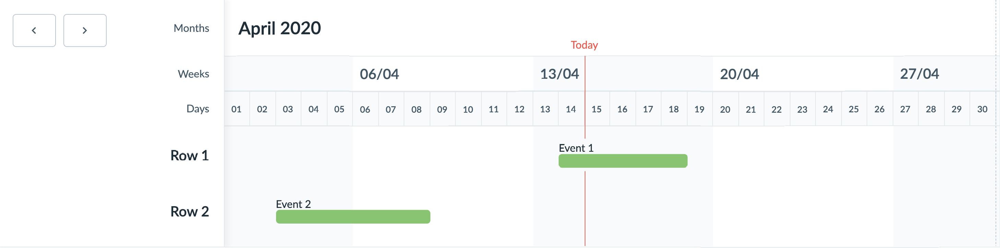
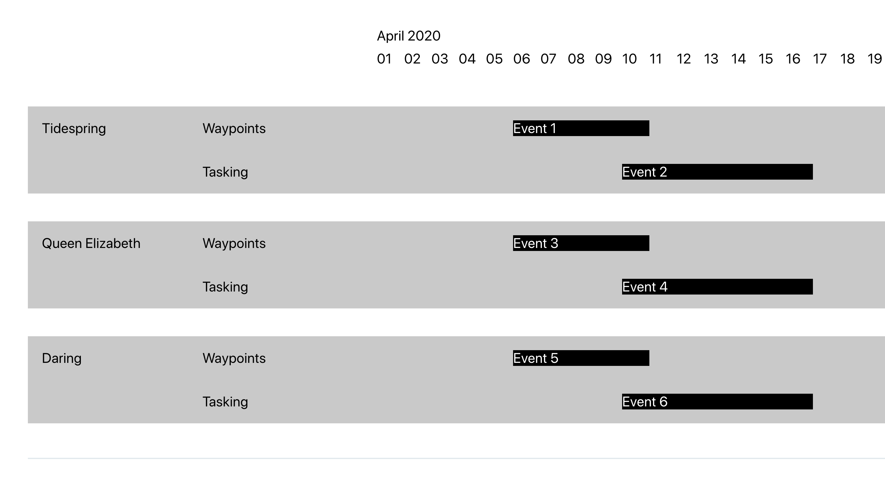

# Compound Timeline

A collection of composable and presentation agnostic Compound Components, Hooks and a Context Provider, to help aid in the creation of scheduling based user-interfaces.



## Table of Contents

- [Motivation](#motivation)
- [Installation](#installation)
- [Options](#options)
- [Example Usage](#example-usage)
- [Compound Components & Composition](#compound-components--composition)
- [Custom Component Presentation](#custom-component-presentation)
  - [Render Props](#render-props)
- [Context Provider](#context-provider)
  - [State & Action Dispatcher](#state--action-dispatcher)
- [Hooks](#hooks)
  - [useTimelinePosition](#usetimelineposition)
- [Advanced Custom Layouts](#advanced-custom-layouts)
- [Hook APIs](#hook-apis)
  - [useTimelinePosition](#usetimelineposition)
- [Component APIs](#component-apis)
  - [Timeline](#timeline)
  - [TimelineTodayMarker](#timelinetodaymarker)
  - [TimelineSide](#timelineside)
  - [TimelineMonths](#timelinemonths)
  - [TimelineWeeks](#timelineweeks)
  - [TimelineDays](#timelinedays)
  - [TimelineHours](#timelinehours)
  - [TimelineRows](#timelinerows)
  - [TimelineRow](#timelinerow)
  - [TimelineEvents](#timelineevents)
  - [TimelineEvent](#timelineevent)
- [Roadmap](#roadmap)
- [Contributing](#contributing)
- [Changelog](#changelog)
- [License](#license)

## Motivation

Identify commonality across applications utilising scheduling related patterns, with the aim to abstract out a library that helps to ensure the integrity and future maintainability of applications with disparate sets of scheduling related use cases. 

We identified commonality across applications in two key areas:

- __How something looks and feels__
  - Somewhat but nuanced based on problem domain

- __How something works 'under the hood'__
  - Date manipulation
  - Positioning and sizing arbitrary components relative to a timeline
  - Generated data structures and state
  - Common but extensible interfaces

## Installation

```
// npm
npm install @royalnavy/css-framework @royalnavy/react-component-library

// yarn
yarn add @royalnavy/css-framework @royalnavy/react-component-library
```

## Options

| Name      | Type   | Required | Default    | Description                                         |
|-----------|--------|----------|------------|-----------------------------------------------------|
| startDate | Date   | True     | -          | A month will display either side of this start date |
| today     | Date   | False    | new Date() | Today's current date - default is system date time  |
| range     | Number | False    | 3          | The number of months to display at any one time     |
| unitWidth  | Number | False    | 30         | The fixed width value of a single day (in pixels)   |

Comprehensive [API documentation](#component-apis) for each of the Compound Components can be found further below.

## Example Usage

You can view a collection of example stories in [Storybook](https://storybook.royalnavy.io/?path=/story/timeline--no-data).

```jsx
import React from 'react'

import { 
  Timeline, 
  TimelineTodayMarker,
  TimelineSide,
  TimelineMonths, 
  TimelineWeeks, 
  TimelineDays, 
  TimelineRows, 
  TimelineRow, 
  TimelineEvents, 
  TimelineEvent 
} from '@royalnavy/react-component-library'

const ExampleTimeline = () => {
  return (
    <Timeline 
      startDate={new Date(2020, 4, 0)} 
      today={new Date(2020, 3, 15)} 
      range={3}
      unitWidth={30}
    >
      <TimelineTodayMarker />
      <TimelineSide/>
      <TimelineMonths />
      <TimelineWeeks />
      <TimelineDays />
      <TimelineRows>
        <TimelineRow name="Row 1">
          <TimelineEvents>
            <TimelineEvent
              startDate={new Date(2020, 3, 14)}
              endDate={new Date(2020, 3, 18)}
            >
              Event 1
            </TimelineEvent>
          </TimelineEvents>
        </TimelineRow>
        <TimelineRow name="Row 2">
          <TimelineEvents>
            <TimelineEvent
              startDate={new Date(2020, 3, 3)}
              endDate={new Date(2020, 3, 8)}
            >
              Event 2
            </TimelineEvent>
          </TimelineEvents>
        </TimelineRow>
      </TimelineRows>
    </Timeline>
  )
}
```

## Compound Components & Composition

In React, [composition](https://reactjs.org/docs/composition-vs-inheritance.html) is a natural pattern of the component model. It's how we build components from other components, of varying complexity and specialization.

The consumer can pick and choose what functionality to include in their Timeline via the declarative JSX API.

## Custom Component Presentation

We aim to empower the consumer by enabling them to overide the presentation of the exposed compound components:

- Full control over look and feel (no opinion about markup or styles)
- Consistent underlying implementation across applications
- Single set of robust automated tests

### Render Props

[Render props](https://reactjs.org/docs/render-props.html) allow us to provide custom persentation layers to our compound components by exposing any relevant internal state. See the example usage below for the `TimelineMonths` component.

```jsx
import React from 'react'
import { format } from 'date-fns'

import { 
  Timeline, 
  TimelineMonths, 
  TimelineRows 
} from '@royalnavy/react-component-library'

const CustomTimelineMonth = (
  index,
  dayWidth,
  daysTotal,
  startDate
) => {
  return (
    <span
      style={{
        display: 'inline-block',
        width: `${dayWidth * daysTotal}px`,
        // ...
      }}
    >
      {format(startDate, 'MMMM yyyy')}
    </span>
  )
}

const ExampleTimeline = () => {
  return (
    <Timeline>
      <TimelineMonths render={CustomTimelineMonth} />
      <TimelineRows>{}</TimelineRows>
    </Timeline>
  )
}
```

## Context Provider

[Context](https://reactjs.org/docs/context.html) provides a way to pass data through the component tree without having to pass props down manually at every level. 

We expose the `TimelineContext` provider so that a consumer can create their own application specific components. The context provider exposes Timeline state and a `dispatch` function for dispatching reducer actions against the store.

### State & Action Dispatcher
In this example we have created a custom component that consumes Timeline related state and dispatches reducer actions when buttons are clicked.

```jsx
import React, { useContext } from 'react' 

import { 
  Timeline, 
  TimelineRows 
  TimelineContext, 
  TIMELINE_ACTIONS 
} from '@royalnavy/react-component-library'

const CustomTimelineComponent = () => {
  const { state: { months, weeks, days, options }, dispatch } = useContext(TimelineContext)

  return (
    <div>
      <button onClick={_ => dispatch({ type: TIMELINE_ACTIONS.GET_PREV })}>Previous</button>
      <button onClick={_ => dispatch({ type: TIMELINE_ACTIONS.GET_NEXT })}>Next</button>
    </div>
  )
}

const ExampleTimeline = () => {
  return (
    <Timeline>
      <CustomTimelineComponent />
      <TimelineRows>{}</TimelineRows>
    </Timeline>
  )
}
```

## Hooks

We expose some [hooks](https://reactjs.org/docs/hooks-intro.html) in order to aid in the creation of your own custom Timeline components.

### useTimelinePosition

This hook takes a `startDate` and optional `endDate` and in return exposes the width and position (in the form of an `offset`) of an item relative to the date range currently displayed by the Timeline.

```jsx
import React from 'react'

import { useTimelinePosition } from '@royalnavy/react-component-library'

const CustomTimelineComponent = ({
  startDate,
  endDate
}) => {
  const {
    width,
    offset,
    isBeforeStart,
    isAfterEnd
  } = useTimelinePosition(startDate, endDate)

  if (isBeforeStart || isAfterEnd) return null

  return (
    <div style={{
        position: 'absolute',
        display: 'inline-block',
        width,
        left: offset
        // ...
      }} 
    />
  )
}
```

## Advanced Custom Layouts
Through the use of clever composition and custom styling, it's possible to create layouts that are either nuanced or high in complexity. Below is an [example of a custom layout](https://github.com/m7kvqbe1/fp-grey-box) that adds groupings to rows:



## Hook APIs

<table>
  <tbody>
    <tr>
      <td colspan="5"><h3>useTimelinePosition</h3></td>
    </tr>
    <tr>
      <th>Name</th>
      <th>Type</th>
      <th>Required</th>
      <th>Default</th>
      <th>Description</th>
    </tr>
    <tr>
      <td>startDate</td>
      <td>Date</td>
      <td>True</td>
      <td>-</td>
      <td>The start date of the event</td>
    </tr>
    <tr>
      <td>endDate</td>
      <td>Date | NULL</td>
      <td>False</td>
      <td>NULL</td>
      <td>The end date of the event</td>
    </tr>
  </tbody>
</table>

## Component APIs

<table>
  <tbody>
    <tr>
      <td colspan="5"><h3>Timeline</h3></td>
    </tr>
    <tr>
      <th>Name</th>
      <th>Type</th>
      <th>Required</th>
      <th>Default</th>
      <th>Description</th>
    </tr>
    <tr>
      <td>startDate</td>
      <td>Date</td>
      <td>True</td>
      <td>-</td>
      <td>A month will display either side of this start date</td>
    </tr>
    <tr>
      <td>today</td>
      <td>Date</td>
      <td>False</td>
      <td>new Date()</td>
      <td>Today's current date - default is the system date time</td>
    </tr>
    <tr>
      <td>range</td>
      <td>Number</td>
      <td>False</td>
      <td>3</td>
      <td>The number of months to display at any one time</td>
    </tr>
    <tr>
      <td>unitWidth</td>
      <td>Number</td>
      <td>False</td>
      <td>30</td>
      <td>The fixed width value of a single day (in pixels)</td>
    </tr>
  </tbody>
  <tbody>
    <tr>
      <td colspan="5"><h3>TimelineTodayMarker</h3></td>
    </tr>
    <tr>
      <th>Name</th>
      <th>Type</th>
      <th>Required</th>
      <th>Default</th>
      <th>Description</th>
    </tr>
    <tr>
      <td>render</td>
      <td>Function<&#8205;today: Date, offset: string&#8205;></td>
      <td>False</td>
      <td>-</td>
      <td>Supply a custom presentation layer</td>
    </tr>
  </tbody>
  <tbody>
    <tr>
      <td colspan="5"><h3>TimelineSide</h3></td>
    </tr>
    <tr>
      <th>Name</th>
      <th>Type</th>
      <th>Required</th>
      <th>Default</th>
      <th>Description</th>
    </tr>
    <tr>
      <td>render</td>
      <td>Function<></td>
      <td>False</td>
      <td>-</td>
      <td>Supply a custom presentation layer</td>
    </tr>
  </tbody>
  <tbody>
    <tr>
      <td colspan="5"><h3>TimelineMonths</h3></td>
    </tr>
    <tr>
      <th>Name</th>
      <th>Type</th>
      <th>Required</th>
      <th>Default</th>
      <th>Description</th>
    </tr>
    <tr>
      <td>render</td>
      <td>Function<&#8205;index: number, dayWidth: number, daysTotal: number, startDate: Date&#8205;></td>
      <td>False</td>
      <td>-</td>
      <td>Supply a custom presentation layer</td>
    </tr>
  </tbody>
  <tbody>
    <tr>
      <td colspan="5"><h3>TimelineWeeks</h3></td>
    </tr>
    <tr>
      <th>Name</th>
      <th>Type</th>
      <th>Required</th>
      <th>Default</th>
      <th>Description</th>
    </tr>
    <tr>
      <td>render</td>
      <td>Function<&#8205;index: number, isOddNumber: boolean, offsetPx: string, widthPx: string, dayWidth: number, daysTotal: number, startDate: Date&#8205;></td>
      <td>False</td>
      <td>-</td>
      <td>Supply a custom presentation layer</td>
    </tr>
  </tbody>
  <tbody>
    <tr>
      <td colspan="5"><h3>TimelineDays</h3></td>
    </tr>
    <tr>
      <th>Name</th>
      <th>Type</th>
      <th>Required</th>
      <th>Default</th>
      <th>Description</th>
    </tr>
    <tr>
      <td>render</td>
      <td>Function<&#8205;index: number, dayWidth: number, date: Date&#8205;></td>
      <td>False</td>
      <td>-</td>
      <td>Supply a custom presentation layer</td>
    </tr>
  </tbody>
  <tbody>
    <tr>
      <td colspan="5"><h3>TimelineHours</h3></td>
    </tr>
    <tr>
      <th>Name</th>
      <th>Type</th>
      <th>Required</th>
      <th>Default</th>
      <th>Description</th>
    </tr>
    <tr>
      <td>blockSize</td>
      <td>number</td>
      <td>False</td>
      <td>6</td>
      <td>Number of hours per block in a day</td>
    </tr>
    <tr>
      <td>render</td>
      <td>Function<&#8205;width: number, time: string&#8205;></td>
      <td>False</td>
      <td>-</td>
      <td>Supply a custom presentation layer</td>
    </tr>
  </tbody>
  <tbody>
    <tr>
      <td colspan="5"><h3>TimelineRows</h3></td>
    </tr>
    <tr>
      <th>Name</th>
      <th>Type</th>
      <th>Required</th>
      <th>Default</th>
      <th>Description</th>
    </tr>
    <tr>
      <td>renderColumns</td>
      <td>Function<&#8205;index: number, isOddNumber: boolean, offsetPx: string, widthPx: string&#8205;></td>
      <td>False</td>
      <td>-</td>
      <td>Supply a custom presentation layer</td>
    </tr>
    <tr>
      <td>children</td>
      <td>React.ReactNode | React.ReactNode[]</td>
      <td>True</td>
      <td>-</td>
      <td>Supply children to be rendered</td>
    </tr>
  </tbody>
  <tbody>
    <tr>
      <td colspan="5"><h3>TimelineRow</h3></td>
    </tr>
    <tr>
      <th>Name</th>
      <th>Type</th>
      <th>Required</th>
      <th>Default</th>
      <th>Description</th>
    </tr>
    <tr>
      <td>name</td>
      <td>string</td>
      <td>True</td>
      <td>-</td>
      <td>A descriptive identifier for the row</td>
    </tr>
    <tr>
      <td>children</td>
      <td>React.ReactNode | React.ReactNode[]</td>
      <td>True</td>
      <td>-</td>
      <td>Supply children to be rendered</td>
    </tr>
  </tbody>
  <tbody>
    <tr>
      <td colspan="5"><h3>TimelineEvents</h3></td>
    </tr>
    <tr>
      <th>Name</th>
      <th>Type</th>
      <th>Required</th>
      <th>Default</th>
      <th>Description</th>
    </tr>
    <tr>
      <td>children</td>
      <td>React.ReactNode | React.ReactNode[]</td>
      <td>True</td>
      <td>-</td>
      <td>Supply children to be rendered</td>
    </tr>
  </tbody>
  <tbody>
    <tr>
      <td colspan="5"><h3>TimelineEvent</h3></td>
    </tr>
    <tr>
      <th>Name</th>
      <th>Type</th>
      <th>Required</th>
      <th>Default</th>
      <th>Description</th>
    </tr>
    <tr>
      <td>startDate</td>
      <td>Date</td>
      <td>True</td>
      <td>-</td>
      <td>The start date of the event</td>
    </tr>
    <tr>
      <td>endDate</td>
      <td>Date</td>
      <td>True</td>
      <td>-</td>
      <td>The end date of the event</td>
    </tr>
    <tr>
      <td>render</td>
      <td>Function<&#8205;endDate: Date, startDate: Date, widthPx: string, offsetPx: string&#8205;></td>
      <td>False</td>
      <td>-</td>
      <td>Supply a custom presentation layer</td>
    </tr>
    <tr>
      <td>children</td>
      <td>React.ReactNode | React.ReactNode[]</td>
      <td>True</td>
      <td>-</td>
      <td>Supply children to be rendered</td>
    </tr>
  </tbody>
</table>

## Roadmap

- [ ] Migrate to independent package within monorepo
- [ ] Adopt [styled-components](https://github.com/styled-components/styled-components) for default presentation
- [ ] Expose `TimelineSide` render prop
- [ ] Add demos to sandbox
- [ ] Iterate upon default presentation (user research and design)
- [ ] Investigate support for advanced features:
  - [ ] Infinite scroll
  - [ ] Lazy loading
  - [ ] View scaling (micro to macro / hours to years)
  - [ ] Drag and drop

## Contributing
The [contributing guide](https://github.com/Royal-Navy/design-system/blob/master/docs/contributing.md) resource presents information about our development process. 

## Changelog
If you have recently updated then read the [release notes](https://github.com/Royal-Navy/design-system/releases).

## License
The Royal Navy Design System is licensed under the [Apache License 2.0](https://github.com/Royal-Navy/design-system/blob/master/LICENSE).
