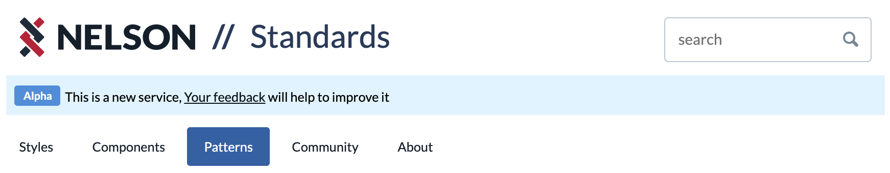
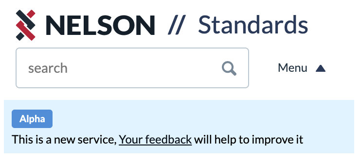
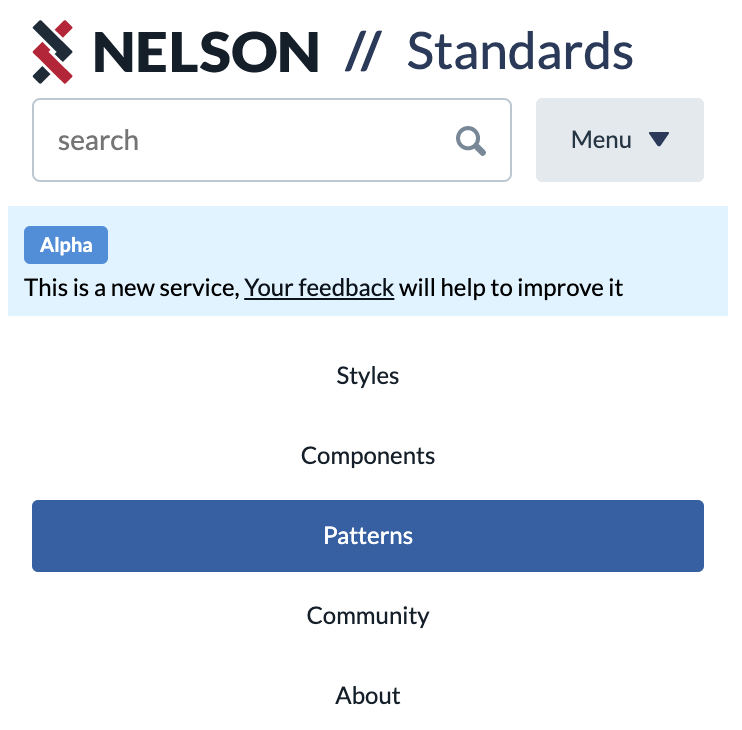

### Usage

The `Masthead` fragment brings together a number of components to form a page fragment in which the site name, search and top
level navigation to be displayed across the top of most pages.

The fragment has been designed to work on both mobile and desktop layouts.

<p></p>
<p></p>
<p></p>

```
  <Masthead
    navItems={navItems}
    onSearch={data => search(data.term))}
    phase="alpha"
  />
```

## Properties

| Name       | Type                        | Required | Default  | Description |                      
| ---------- | --------------------------- | -------- | -------  | ----------- |
| navItems   | any[]                       | false    |          | Items to pass to the Nav component. Look at the Nav component for details of the format they must take. |
| onSearch   | ({ term: string}) => void   | false    | () => {} | Masthead contains a search box, this function is called with an object containing the term to search for when the form is submitted|
| phase      | string: "alpha" or "beta"   | false    |          | If a phase banner must be displayed it should specify if it is alpha or beta |
| title      | string                      | false    |          | An optional title to display after the word 'Nelson' |
