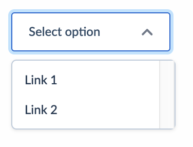

## Overview

Dropdowns are toggleable, contextual overlays for displaying lists of links and actions. They should be used to hide secondary actions a component, and not to capture an option selection in a Form. If you are looking for elements to use within a Form context, please visit the [Selects](/Develop/Components/Selects) documentation.

Dropdowns are activated by clicking. Hover effects should be reserved for providing the user with additional information & links (for example, [Tooltips](/Develop/Components/Tooltips)), as having hover effects on actions often results in users causing them to unintentionally fire.




## HTML Example

```html
<div class="rn-dropdown" role="listbox">
  <span class="rn-dropdown__label">Pick site</span>
  <a class="rn-dropdown__link" href="https://www.apple.com">Apple</a>
  <a class="rn-dropdown__link" href="https://www.microsoft.com">Microsoft</a>
</div>
```

The HTML version of this component requires `@royalnavy/html-component-library` in order to enhance it's markup into a component that shows a drop which can be clicked on and reveal a list of links.

## React

If you are building your NELSON application in React, implementing the Dropdown component is considerably more straightforward. Firstly, import the component from our React package:

```
  @import { RNDropdown } from '@RoyalNavy/react-component-library'
```

Next, include the component in the location where you want it to be rendered. All available props are listed in the Props section below the example.

```html
<RNDropdown options={options} onChange={value => { action(`Select ${value}`) }}
label="Dropdown" size="regular" />
```

#### Props

| Prop Name    | Values                    | Required |
| ------------ | ------------------------- | -------- |
| **Label**    | `{String}`                | true     |
| **onChange** | `{Function}`              | true     |
| **options**  | `{Object}`                | true     |
| **size**     | `small` `regular` `large` | false    |

###

### Vue JS

A Vue JS Dropdown can either display a list of links or act like a form control and emit a value for an event.

#### Properties

| Name    | Type                                                          | Required | Description                                                                                            |
| ------- | ------------------------------------------------------------- | -------- | ------------------------------------------------------------------------------------------------------ |
| label   | String                                                        | False    | The label to be shown in the dropdown if no option is picked.                                          |
| value   | String/Number/Boolean                                         | False    | The current value, is using the form variation                                                         |
| options | Array[{label:string,href:string} or {label:string,value:any}] | True     | An array of options to display. Each option should have a label and href or a value and optional label |

#### Events

| Name  | Description                                        |
| ----- | -------------------------------------------------- |
| input | When the user pick an option, passes the new value |

#### Example

```
const Demo = {
  components: { RnDropdown },
  methods: {
    onInput(newValue) {
      this.colour = newValue
    },
  },
  data() {
    return {
      colour: '',
      options: [
        { label: 'Green', value: 'green' },
        { label: 'Red', value: 'red' },
      ]
    }
  },
  template: `
    <div>
      <rn-dropdown
        label="Pick a colour"
        :options="options"
        :value="colour"
        v-on:input="onInput"
      />
      <hr>
      <p>{{colour}}</p>
    </div>
  `,
}

const Demo2 = {
  components: { RnDropdown },
  data() {
    return {
      options: [
        { label: 'Apple', value: 'https://www.apple.com' },
        { label: 'Microsoft', value: 'https://www.microsoft.com' },
      ]
    }
  },
  template: `
    <div>
      <rn-dropdown label="Pick a site" :options="options" />
    </div>
  `,
}
```
